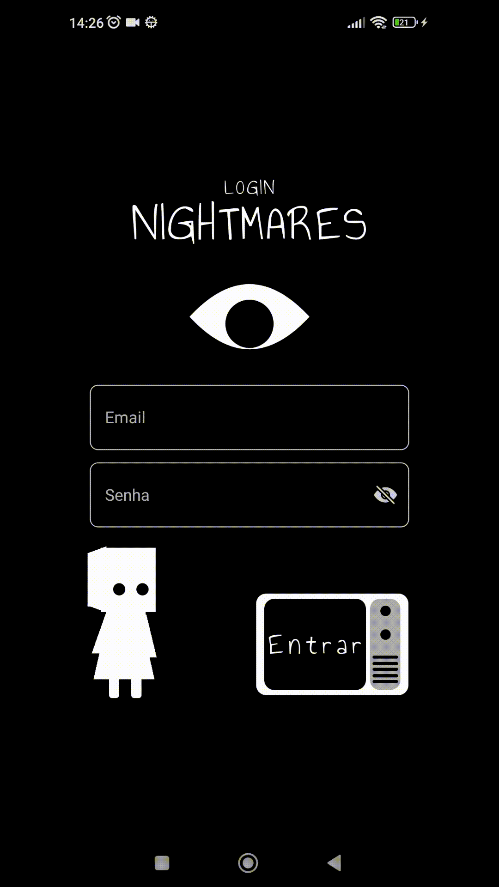

# Visual Login React Native 05


## Descrição
Tela de Login inspirada no jogo Little Nightmares. Trazendo animações que reagem com as ações do usuário, utilizando react-native-reanimated para as animações, e react-native-svg para desenhos mais complexos.

## Informações adicionais
Este projeto foi criado com o React Natice CLI usando [`@react-native-community/cli`](https://github.com/react-native-community/cli).


Versão do node v20.17.0

## Prévia


# Instalação
## Passo 1
Clone o projeto
```bash
git clone https://github.com/paulogermanopg/RN_login_project_05.git
```
## Passo 2
Instale os pacotes necessários
```bash
#use node =>18

#usando o npm
npm install

#usando o yarn (recomendado)
yarn install
```

## Passo 3
Se necessário, fixar as fonts usadas para o projeto com:
```bash
npx react-native-asset
```
# Licença do MIT
Copyright (c) 2025 Paulo Germano

Permission is hereby granted, free of charge, to any person obtaining a copy
of this software and associated documentation files (the "Software"), to deal
in the Software without restriction, including without limitation the rights
to use, copy, modify, merge, publish, distribute, sublicense, and/or sell
copies of the Software, and to permit persons to whom the Software is
furnished to do so, subject to the following conditions:

The above copyright notice and this permission notice shall be included in all
copies or substantial portions of the Software.

THE SOFTWARE IS PROVIDED "AS IS", WITHOUT WARRANTY OF ANY KIND, EXPRESS OR
IMPLIED, INCLUDING BUT NOT LIMITED TO THE WARRANTIES OF MERCHANTABILITY,
FITNESS FOR A PARTICULAR PURPOSE AND NONINFRINGEMENT. IN NO EVENT SHALL THE
AUTHORS OR COPYRIGHT HOLDERS BE LIABLE FOR ANY CLAIM, DAMAGES OR OTHER
LIABILITY, WHETHER IN AN ACTION OF CONTRACT, TORT OR OTHERWISE, ARISING FROM,
OUT OF OR IN CONNECTION WITH THE SOFTWARE OR THE USE OR OTHER DEALINGS IN THE
SOFTWARE.
